# Chaos in stb

C library that simulates fractals and attractors (only in stb). You can generate them into terminal as ASCII art or into image (using [stb library](https://github.com/nothings/stb)).

## Table of contents

- [Bifurcation diagram](#bifurcation-diagram)
- [Attractors](#attractors)
  - [Lorenz attractor](#lorenz-attractor)
  - [Thomas attractor](#thomas-attractor)
  - [Rössler attractor](#rössler-attractor)
  - [Chen & Lu Chen attractor](#chen-lu-chen-attractor)
  - [Rabinovich–Fabrikant attractor](#rabinovichfabrikant-attractor)
  - [Hénon map](#hénon-map)
- [Fractals](#fractals)
  - [Cantor set](#cantor-set)
  - [Sierpiński carpet](#sierpiski-carpet)
  - [Sierpiński triangle](#sierpiski-triangle)
  - [Mandelbrot set](#mandelbrot-set)
  - [Koch snowflake](#koch-snowflake)
  - [Barnsley fern](#barnsley-fern)

## Bifurcation diagram

- [ ] Available in ASCII
- [x] Available in stb

$$x_{n+1} = x_n \cdot k \cdot (1- x_n)$$

|                                                   stb                                                    |
| ---------------------------------------------------------------------------------------- |
| 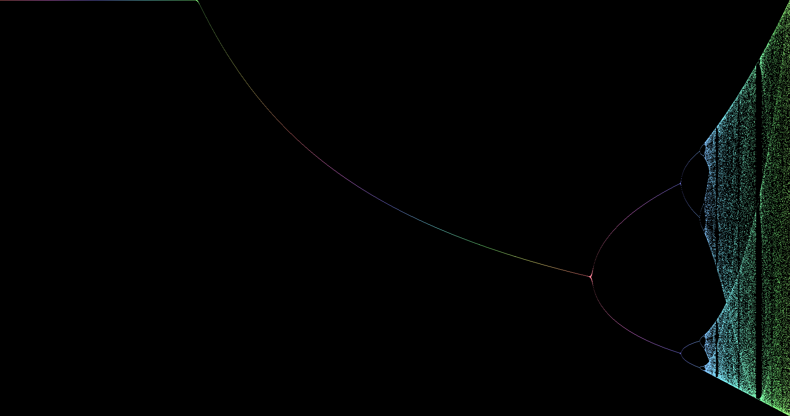 |

## Attractors

### Lorenz attractor

Lorenz attractor is a strange attractor named after Edward Lorenz who described it in 1963.

For $\sigma = 10$, $\rho= 28$, $\beta = \frac 83$ and $x=0.1, y=0, z=0$ is the system described by the following three equations: $\begin{cases}\frac{dx}{dt} = \sigma (y-x)\\\frac{dy}{dt} = x (\rho -z) -y\\\frac{dz}{dt} = xy-\beta x\end{cases}$

|                                                       stb                                                        |
| ---------------------------------------------------------------------------------------------- |
| 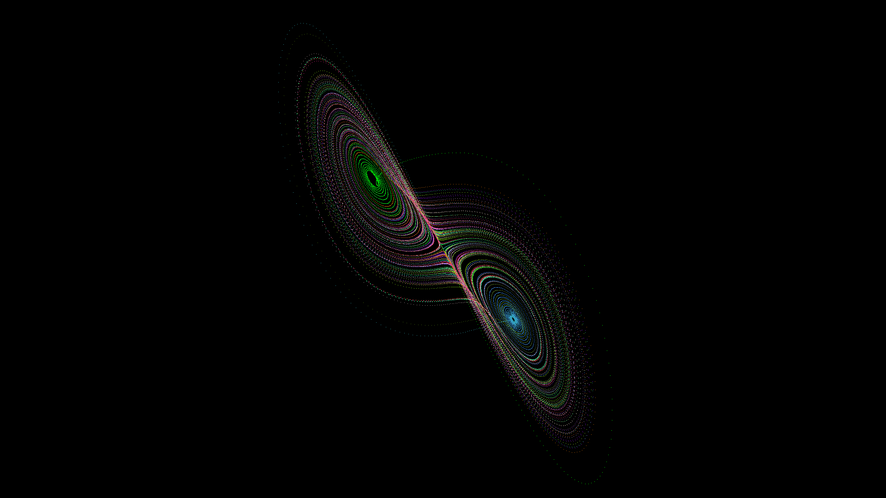 |

### Thomas attractor

Thomas' cyclically symmetric attractor is a 3D strange attractor named after René Thomas.

For $\lambda = 0.19$ and $x=0.1, y=0, z=0$ is the system described by the following three equations: $\begin{cases}\frac {dx}{dt}= \sin(y) - \lambda x\\\frac {dy}{dt}= \sin(z) - \lambda y\\\frac {dz}{dt}= \sin(x) - \lambda z\end{cases}$

|                                                             stb                                                              |
| --------------------------------------------------------------------------------------------------------- |
| 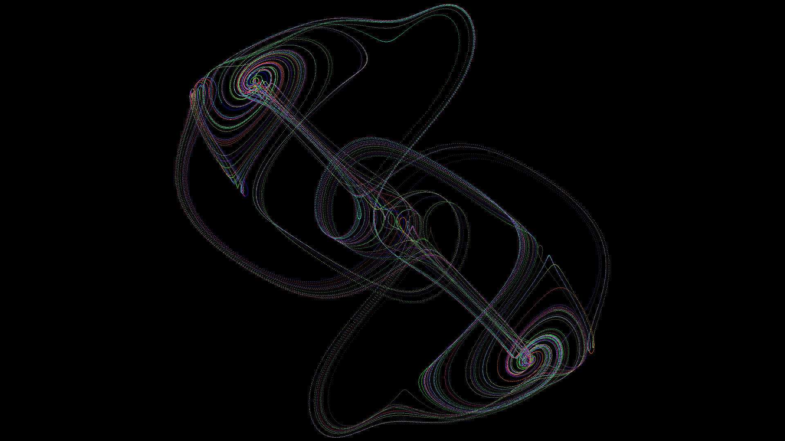 |

### Rössler attractor

Lorenz attractor is an attractor named after Otto Rössler who described it in 1976.

For $\alpha = 0.2$, $\beta= 0.2$, $\gamma= 14$ and $x=0.1, y=0, z=0$ is the system described by the following three equations: $\begin{cases}\frac {dx}{dt}=-y-z\\\frac {dy}{dt}=x+\alpha y\\\frac {dz}{dt}=\beta+z\cdot(x-\gamma)\end{cases}$

|                                                         stb                                                         |
| ------------------------------------------------------------------------------------------------- |
| 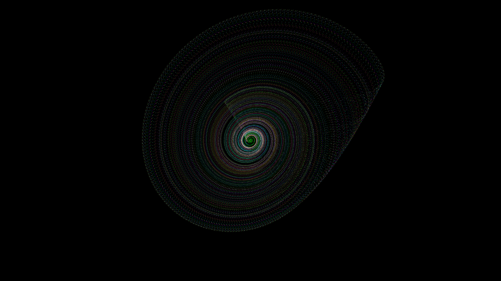 |

### Chen & Lu Chen attractor

The (Lu) Chen attractor is named after Jinhu Lu and Guanrong Chen.

For Chen attractor $\alpha = 40, \beta = 3, \gamma = 28$ and $x=-0.1, y=0.5, z=-0.6$ is the system described by the following three equations: $\begin{cases}\frac {dx}{dt}=\alpha \cdot (y - x)\\\frac {dy}{dt}=(\gamma - \alpha) \cdot x - xz + \gamma  y\\\frac {dz}{dt}=xy - \beta z\end{cases}$

For Lu Chen attractor $\alpha = 34.5, \beta = 9, \gamma = 20, \omega = -10$ and $x = 0.1, y = 0.3, z = -0.6$ is the system described by the following three equations: $\begin{cases}\frac {dx}{dt}=\alpha \cdot (y - x)\\\frac {dy}{dt}=x - xz + \gamma y + \omega\\\frac {dz}{dt}=xy - \beta z\end{cases}$

|                                                     Chen                                                      |                                                        Lu Chen                                                        |
| ----------------------------------------------------------------------------------------------- | ------------------------------------------------------------------------------------------------------- |
| 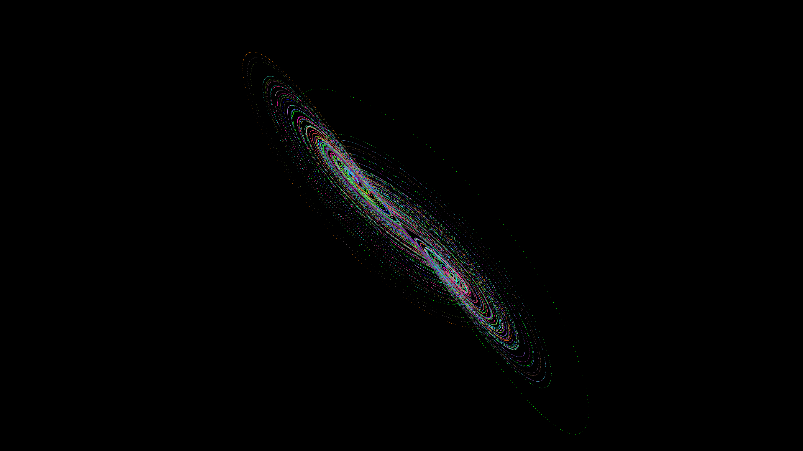 | 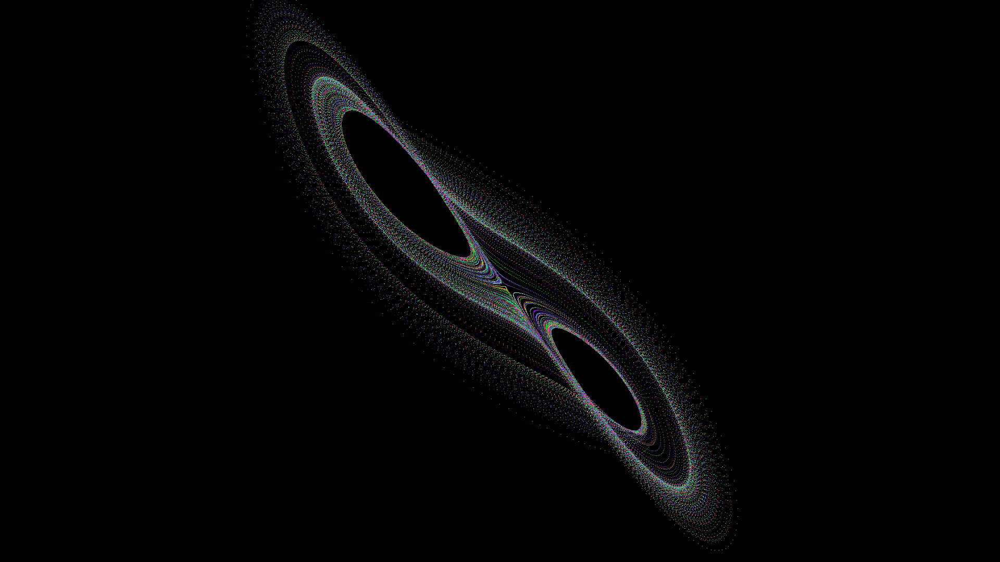 |

### Rabinovich–Fabrikant attractor

The Rabinovich–Fabrikant equations are a set of three equations named after Mikhail Rabinovich and Anatoly Fabrikant, who described them in 1979.

For $\alpha = 1.1, \gamma = 0.87$ and $x=-1, y=0, z=0.5$ is the system described by the following three equations: $\begin{cases}\frac {dx}{dt}=y \cdot (z-1+x^2) + \gamma x\\\frac {dy}{dt}=x\cdot (3z+1-x^2) + \gamma y\\\frac {dz}{dt}=-2z\cdot (\alpha +xy)\end{cases}$

|                                                           stb 1                                                           |                                                            stb 2                                                             |
| ------------------------------------------------------------------------------------------------------- | --------------------------------------------------------------------------------------------------------- |
| 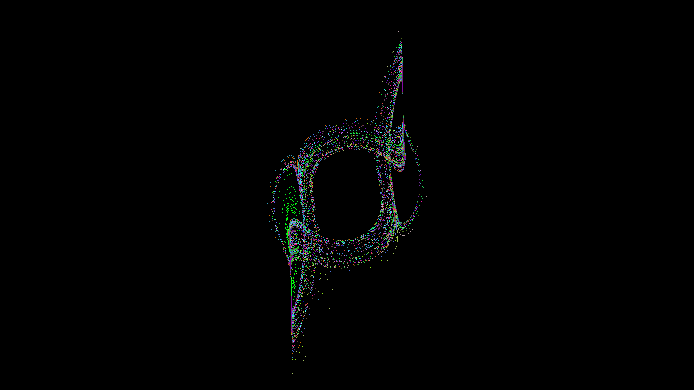 | 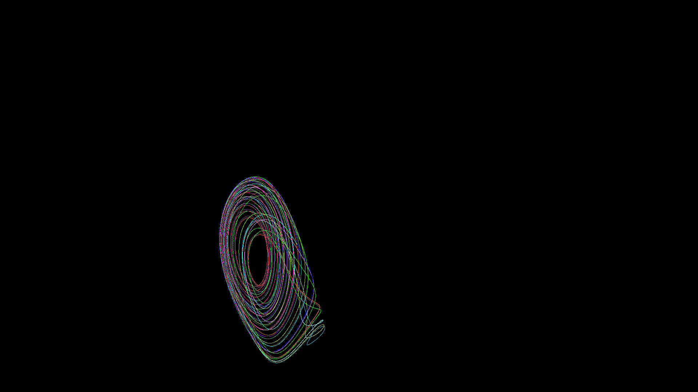 |

### Hénon map

The Hénon map is a strange attractor named after Michel Hénon.

For $\alpha = 1.4, \beta= 0.3$ and $x=0.1, y=0.1$ is the system described by the following two equations: $\begin{cases}x_{n+1} = 1 - \alpha x_n^2 + y_n \\y_{n+1} = \beta x_n\end{cases}$

|                                                 stb                                                 |
| ------------------------------------------------------------------------------------ |
| 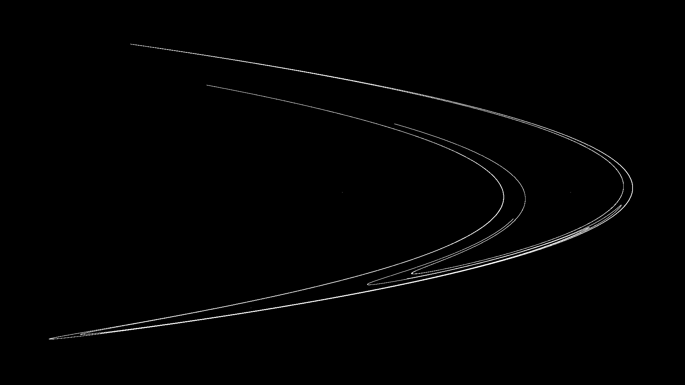 |

## Fractals

### Cantor set

- [x] In ASCII
- [x] In stb

A Cantor set is a fractal that is formed by removing the middle thirds of a line. It is named after Georg Cantor, who introduced it in 1883.

We get it by removing the interval $(\frac{1}3,\frac{2}3)$ of the content from the line $[0,1]$ . The open middle third of each of these remaining segments is deleted, and there are left these four segments: $[0,\frac{1}9] \cup [\frac{2}9,\frac{1}3] \cup [\frac{2}3,\frac{7}9] \cup [\frac{8}9,1]$.

The length of the Cantor line converges to $0$.

$$\frac{1}3 + \frac{2}9 + \frac{4}{27} + \frac{8}{81} + ... = \sum_{n=0}^{\infty} \frac{2^n}{3^{n+1}} = \frac{1}3 
 \sum_{n=0}^{\infty} \frac{2^n}{3^n} = \frac{1}3 (\frac{1}{1 - \frac{2}3 } ) = 1$$
 

The Cantor set gas a fractal dimension equal to $\frac{ln(2)}{ln(3)} \approx 0.6309...$.

|                                                      ASCII                                                      |                                                     stb                                                      |
| ------------------------------------------------------------------------------------------------ | ------------------------------------------------------------------------------------------- |
| 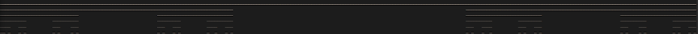 | 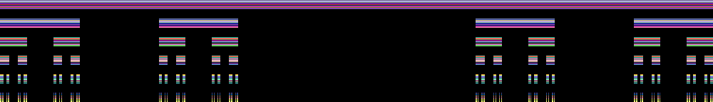 |

### Sierpiński carpet

- [x] Available in ASCII
- [x] Available in stb

A Sierpiński carpet is a fractal formed by recursively removing squares from a surface. It is named after Wacław Sierpiński, who described it in 1916 and it's a generalization of Cantor's set into two dimensions.

The area of a Sierpiński carpet converges to $0$.

$$S = 1 - \sum_{n=0}^\infty \frac{8^n}{9^{n+1}} \Longrightarrow a_1 = \frac{1}9, q = \frac{8}9 \Longrightarrow S = 1 - s = 1-\frac{\frac{1}9}{1-\frac{8}9} = 1 - 1 = 0$$

The Sierpiński carpet has a fractal dimension equal to $\frac{log(8)}{log(3)} \approx 1.8928...$ .

|                                                                   ASCII                                                                   |                                                                  stb                                                                  |
| ---------------------------------------------------------------------------------------------------------------------- | ---------------------------------------------------------------------------------------------------------------- |
| 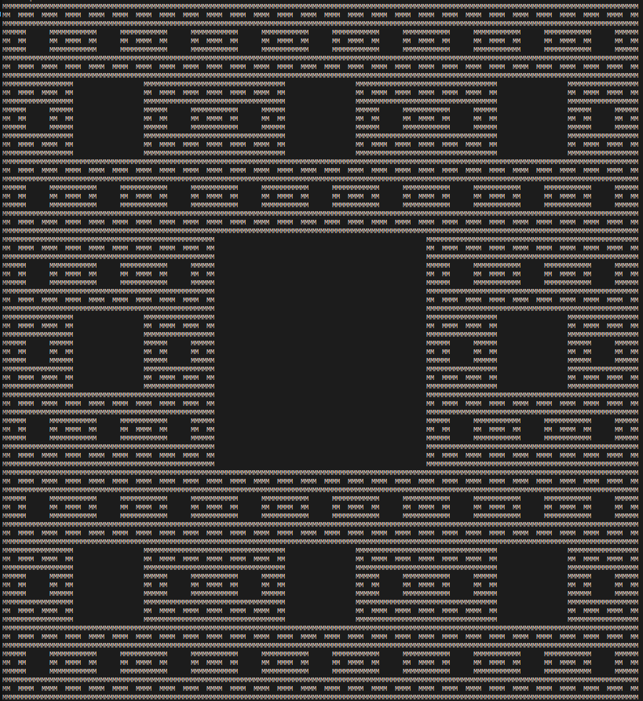 | 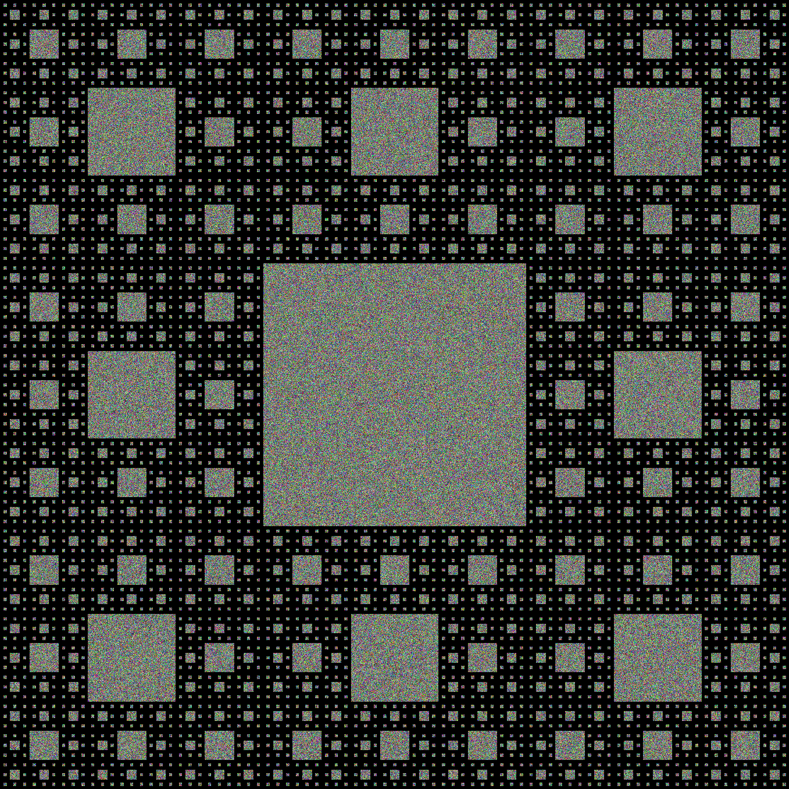 |

### Sierpiński triangle

- [ ] Available in ASCII
- [ ] Available in stb

### Mandelbrot set

- [x] Available in ASCII
- [x] Available in stb
- [x] Available in SDL

|                                                                       ASCII                                                                        |                                                                   stb                                                                    |                                                             SDL                                                             |
| ----------------------------------------------------------------------------------------------------------------------------- | ------------------------------------------------------------------------------------------------------------------- | ---------------------------------------------------------------------------------------------------------- |
| 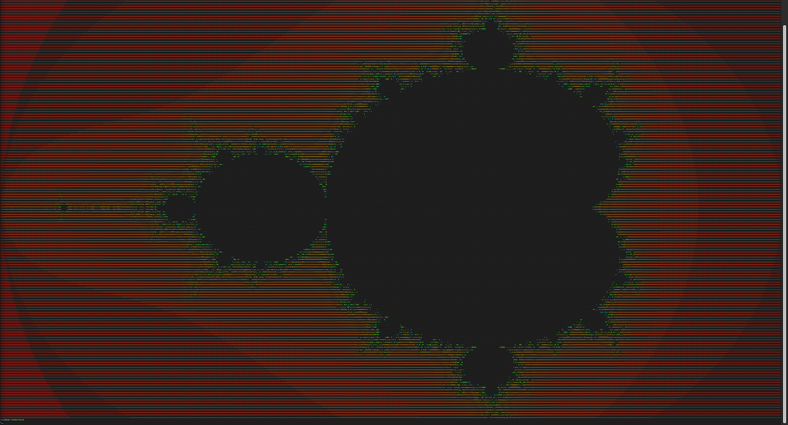 | 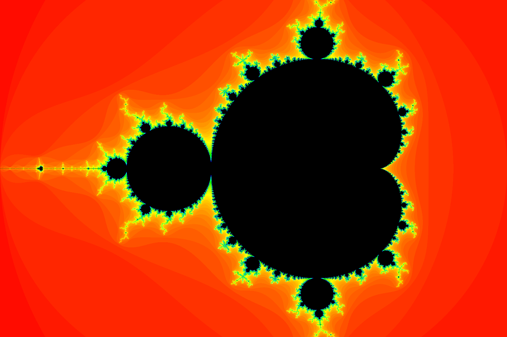 |  |

### Koch snowflake

- [ ] Available in ASCII
- [ ] Available in stb

### Barnsley fern

- [ ] Available in ASCII
- [ ] Available in stb
