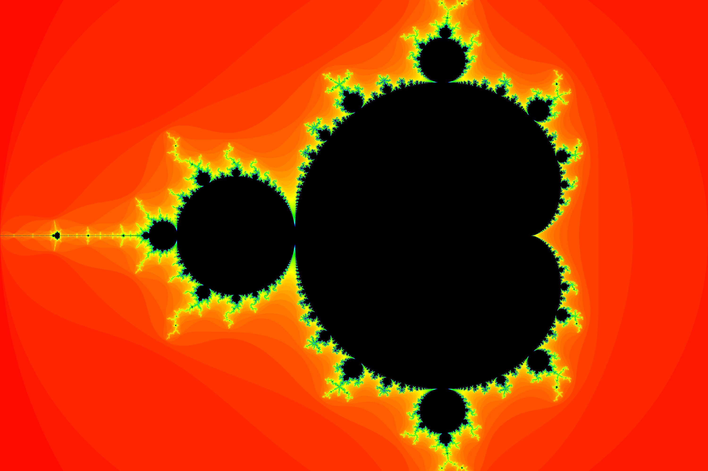
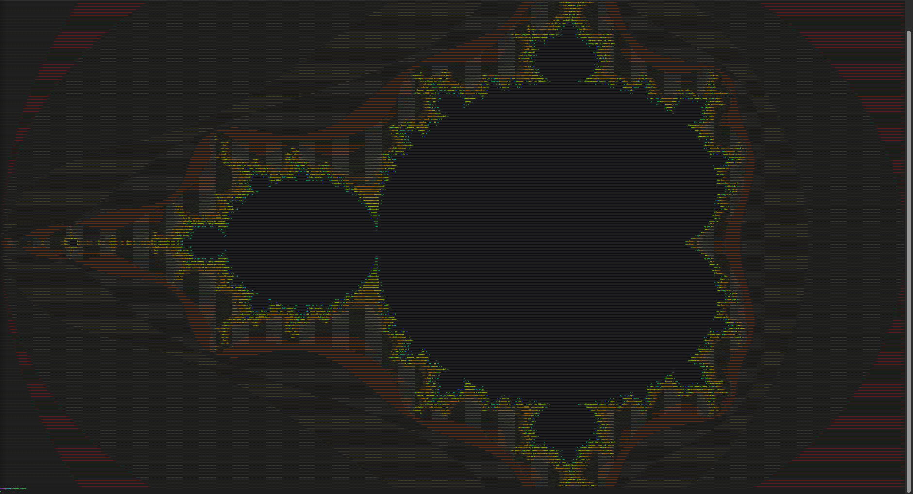

# Fractal C library

C library that simulates many fractals. You can generate them into terminal, into GUI (`graphics.h`) or into image.

## Mandelbrot set

- currently in main development

- [x] Available in ascii
- [x] Available in GUI (almost done)
- [x] Available in rendered image

## Sierpińsky carpet

- [x] Available in ascii
- [ ] Available in GUI
- [ ] Available in rendered image

## Sierpińsky Triengle

- [ ] Available in ascii
- [ ] Available in GUI
- [ ] Available in rendered image

## TODO
- [ ] ASCII User interface
- [x] Mandebrot ascii
- [x] Mandebrot GUI
- [x] Mandebrot render image
- [x] Sierpińsky carpet ascii
- [ ] Sierpińsky carpet GUI
- [ ] Sierpińsky carpet render image
- [ ] Sierpińsky triangle ascii
- [ ] Sierpińsky triangle GUI
- [ ] Sierpińsky triangle render image
