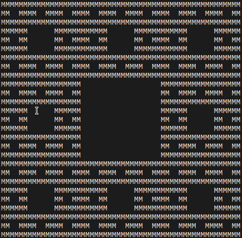
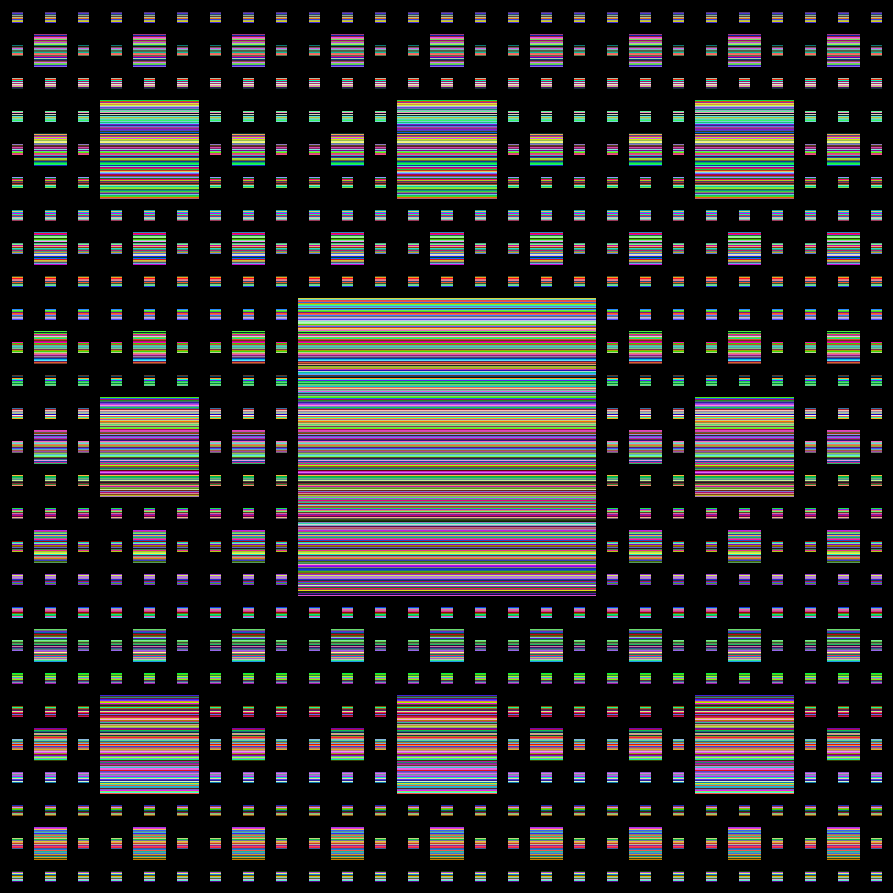
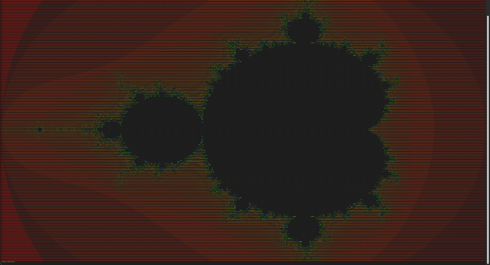
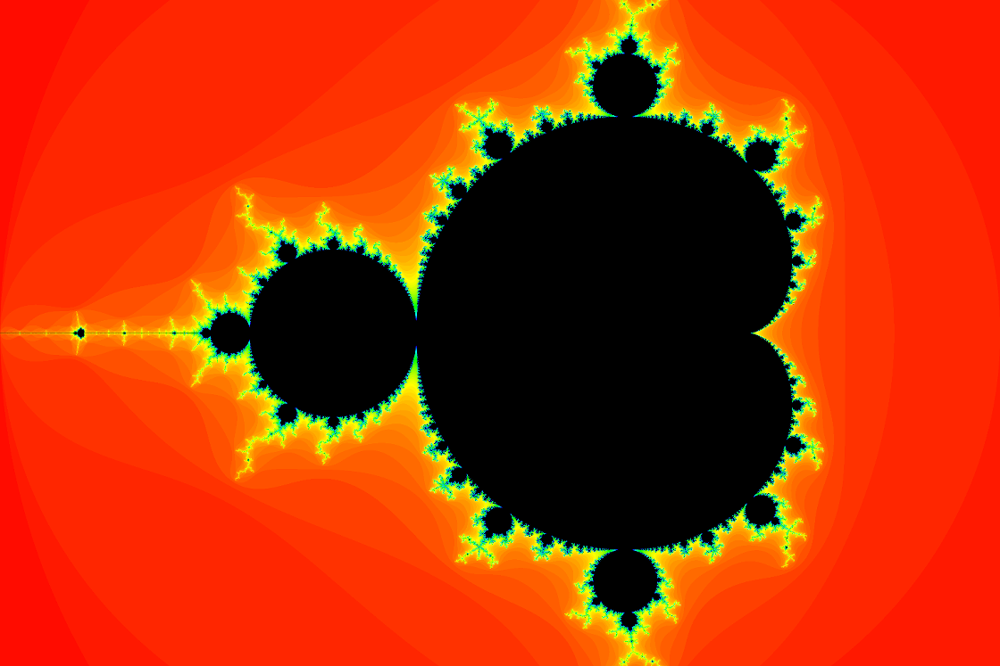
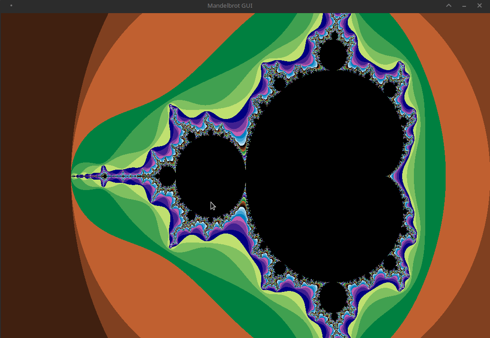

# Chaos in stb

C library that simulates many fractals and attractors. You can generate them into terminal as ASCII art or into image rendered using [stb library](https://github.com/nothings/stb).

## Cantor set

- [ ] Available in ASCII
- [ ] Available in stb

## Sierpiński carpet

- [x] Available in ASCII
- [x] Available in stb

A Sierpiński carpet is a fractal formed by recursively removing squares from a surface. It is named after its founder, the Polish mathematician Wacław Sierpiński, who described it in 1916.

This fractal is a generalization of Cantor's set into two dimensions.

It is obtained by removing $\frac{1}9$ of the content from the square, and removing $\frac{1}9$ of their original content from the remaining $8$ parts, each of which has $\frac{1}9$ of their content again in the same way. This procedure is repeated indefinitely. Again, it is easy to compute the area of a Sierpiński carpet that converges to zero.

The math proof: $S = 1 - \sum_{n=0}^\infty \frac{8^n}{9^{n+1}} \Longrightarrow a_1 = \frac{1}9, q = \frac{8}9 \Longrightarrow S = 1 - s = 1-\frac{\frac{1}9}{1-\frac{8}9} = 1 - 1 = 0$

The Sierpiński carpet has a fractal (Hausdorff) dimension equal to $\frac{log(8)}{log(3)} \approx 1.8928...$ .

|                                       ASCII                                        |                                      stb                                       |
| ---------------------------------------------------------------------------------- | ------------------------------------------------------------------------------ |
|  |  |

## Sierpiński triangle

- [ ] Available in ASCII
- [ ] Available in stb

## Lonenz attractor

- [ ] Available in ASCII
- [ ] Available in stb

## Mandelbrot set

- [x] Available in ASCII
- [x] Available in stb
- [x] Available in SDL

|                                       ASCII                                        |                                    stb                                     |                                 SDL                                  |
| ---------------------------------------------------------------------------------- | -------------------------------------------------------------------------- | -------------------------------------------------------------------- |
|  |  |  |

## Koch snowflake

- [ ] Available in ASCII
- [ ] Available in stb

## Barnsley fern

- [ ] Available in ASCII
- [ ] Available in stb

## Bifurcation graph

- [ ] Available in ASCII
- [ ] Available in stb

## TODO
- [ ] ASCII User interface
- [ ] Cantor set
    - [ ] ASCII
    - [ ] stb
- [x] Sierpinski carpet
    - [x] ASCII
    - [x] stb
- [ ] Sierpinski triangle
    - [ ] ASCII
    - [ ] stb
- [ ] Lonenz attractor
    - [ ] ASCII
    - [ ] stb
- [x] Mandelbrot set
    - [x] ASCII
    - [x] stb
    - [x] SDL
- [ ] Koch snowflake
    - [ ] ASCII
    - [ ] stb
- [ ] Barnsley fern
    - [ ] ASCII
    - [ ] stb
- [ ] Bifurcation graph
    - [ ] ASCII
    - [ ] stb