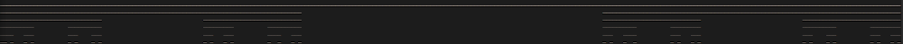
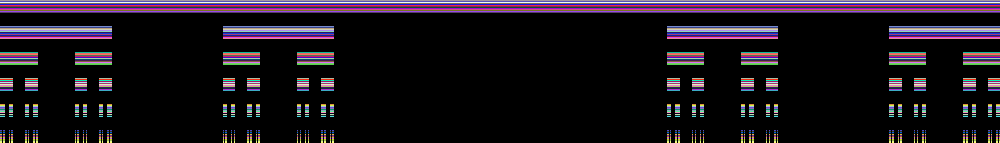

# Chaos in stb

C library that simulates many fractals and attractors. You can generate them into terminal as ASCII art or into image rendered using [stb library](https://github.com/nothings/stb).

## Cantor set

- [x] Available in ASCII
- [x] Available in stb

|                              ASCII                              |                             stb                              |
| --------------------------------------------------------------- | ------------------------------------------------------------ |
|  |  |

## Sierpiński carpet

- [x] Available in ASCII
- [x] Available in stb

|                                       ASCII                                        |                                      stb                                       |
| ---------------------------------------------------------------------------------- | ------------------------------------------------------------------------------ |
|  |  |

## Sierpiński triangle

- [ ] Available in ASCII
- [ ] Available in stb

## Lonenz attractor

- [ ] Available in ASCII
- [ ] Available in stb

## Mandelbrot set

- [x] Available in ASCII
- [x] Available in stb
- [x] Available in SDL

|                                       ASCII                                        |                                    stb                                     |                                 SDL                                  |
| ---------------------------------------------------------------------------------- | -------------------------------------------------------------------------- | -------------------------------------------------------------------- |
|  |  |  |

## Koch snowflake

- [ ] Available in ASCII
- [ ] Available in stb

## Barnsley fern

- [ ] Available in ASCII
- [ ] Available in stb

## Bifurcation graph

- [ ] Available in ASCII
- [ ] Available in stb

## TODO
- [ ] ASCII User interface
- [x] Cantor set
    - [x] ASCII
    - [x] stb
- [x] Sierpinski carpet
    - [x] ASCII
    - [x] stb
- [ ] Sierpinski triangle
    - [ ] ASCII
    - [ ] stb
- [ ] Lonenz attractor
    - [ ] ASCII
    - [ ] stb
- [x] Mandelbrot set
    - [x] ASCII
    - [x] stb
    - [x] SDL
- [ ] Koch snowflake
    - [ ] ASCII
    - [ ] stb
- [ ] Barnsley fern
    - [ ] ASCII
    - [ ] stb
- [ ] Bifurcation graph
    - [ ] ASCII
    - [ ] stb
