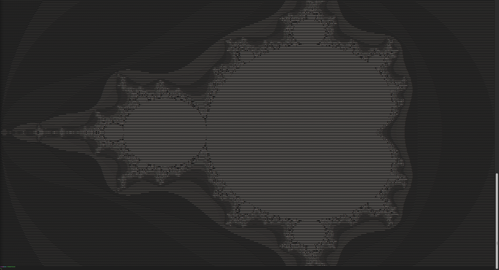
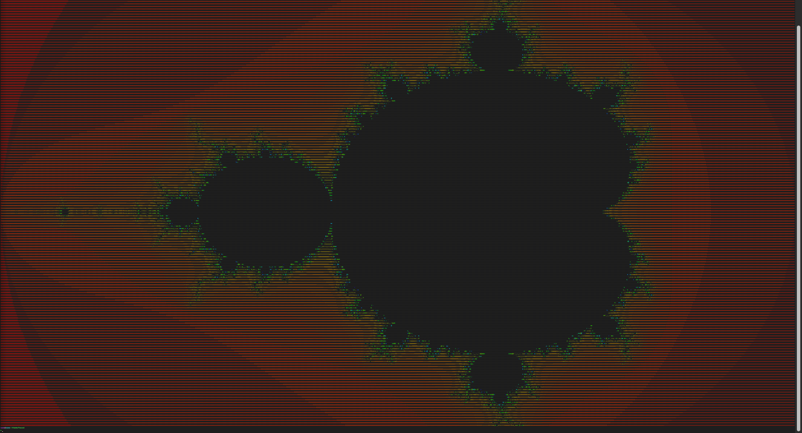
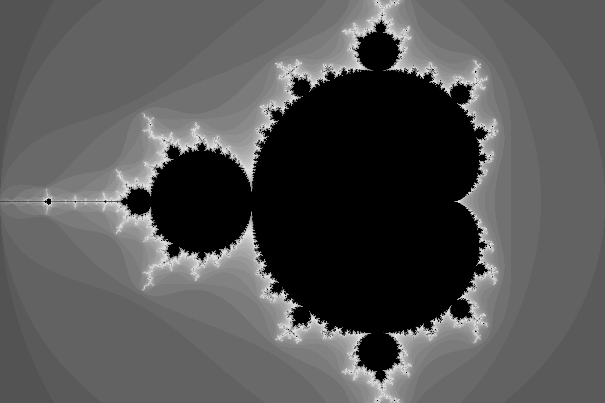
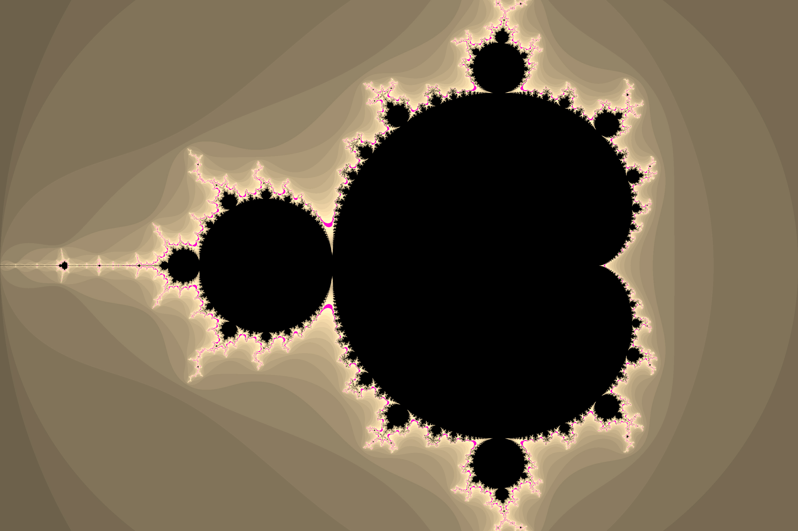

Mandelbrot set
====

## Examples

### Mandelbrot set ASCII

*Resolution 169 x 931; min zoom*

| Normal mode ASCII | Color mode ASCII | Color mode inverse ASCII |
| --- | --- | --- |
|  |  |  |

Text example also avaiable [here](mandelbrot_ascii.txt).

<br>

### Mandelbrot set Rendered images

*Rendered 3000 x 2000 using STB, 80 iterations*

| Color mode | Gray filter | Sepia filter |
| --- | --- | --- |
|  |  |  |

<br>

### Mandelbrot set GUI (SDL)
*Resolution 1080 x 720, made using SDL, 80 iterations*


<br>


### A little bit of theory 

The equation for Mandelbrot set is:  $f_{c}(z)=z^{2}+c$

All we have to know (and realise) is in this table:

| $z_0=0$ |  | $z_{n+1}=z_n^2+c$ | $c = a + bi$ | $i^2 = -1$ |
|---------|--|-------------------|--------------|------------|

When plugged into the main equation, we get:
$z_1 = 0^2 + c \iff z_1 = a+bi$

So all we have now is $c \in \mathbb{C}$.

But when we continue:
$z_2 = z_1^2+c \iff z_2 = c^2+c \iff z_1 = (a+bi)^2 + c$

Then $(a + bi)^2$ *using $A^2 + 2AB + B^2$*

$(a+bi)^2 = a^2 + 2abi + b^2 \cdot i^2 = a^2 - b^2 + 2abi$

Which is, as we can see, another complex number with real part $a^2 - b^2$ and imaginary one $2ab$.

This process will continue indefinitely, so we need to set limits → you can set whatever you want, I set **80** (on my PC it's still pretty fast :] and it looks nice (in color) ). `#define LIMIT 80`


### Programming integration

Now we need to incorporate all these simple mathematical calculations into the code.

First we need to define all the important values.

```c
#define WIDTH 1080
#define HEIGHT 720

#define REAL_START -2.5   // start value for real part
#define REAL_END 1.0
#define IMAG_START -1     // start value for imaginary part
#define IMAG_END 1.0

#define ZOOM 2            // zoom starts at 2
#define ITERATION 80      // number of iterations - (higher = slower)
```

Now we have to represent "pixels". It's gonna be `x` and `y` loop.
We can calculate the starting $a$ and $b$ using the defined values.

```c
double rs = REAL_START, re = REAL_END;
double is = IMAG_START, ie = IMAG_END;

// function() {
    for (int y = 0; y < HEIGHT; y++) {
        for (int x = 0; x < WIDTH; x++) {
            // a... real number; 
            // b... imaginary number
            double a = rs + (((double) x / HEIGHT)/1.5) * (re - rs);
            double b = is + (((double) y / WIDTH)*1.5) * (ie - is);

            // c = a + bi;
            double complex c = CMPLX(a, b);

            // calculating mandelbrot
            int m = calculateMandel(c);
```

Let's integrate math and calculate the Mendelbrot set...
We can proceed as in the theoretical part. Let $z=0$. We know that the Hausdorff measure is 2, so we won't have a higher value.

If $|z_n| \leq m$ and if $n$ is less than the iterative limit (`ITERATION`), we can calculate using the basic equation: $z_{n+1}=z_n^2+c$.

For clarity, I created the parameter `zz`, it's just a powered $z$.

*The `Cpow` and `Cadd` functions are only for simple operations with complex numbers.*

```c

int calculateMandel(double complex c) {
    double complex zz, z = 0.0;
    int n = 0;

    // |z| <= 2;  Hausdorff measure = 2
    while ((cabs(z) <= 2) && (n < ITERATION)) {
        // zz = z^2
        // z = z^2 + c <=> z = zz + c
        zz = Cpow(z);
        z = Cadd(zz, c);
        
        n++;
    } return n;
}

```

## Adding color

Mandelbrot set is much nicer when displayed in colors. 
First we need to convert HSV (hue, saturation, value) to RGB (red, green, blue). I have created a simple converter, based on the basics from [this](https://www.rapidtables.com/convert/color/hsv-to-rgb.html) website.

```c
            int m = calculateMandel(c);

            if (m < ITERATION) {
                int R, G, B;

                int H = (255 * m) / ITERATION;
                int S = 100;
                int V = 100;

                int r = hsv_to_rgb(H, S, V, 0);
                int g = hsv_to_rgb(H, S, V, 1);
                int b = hsv_to_rgb(H, S, V, 2);
```

I have 4 ways to color it here.

1. red (main color)

Nothing changes, the RGB is calculated based on the previous function. They are just redefined to the resulting values from `r` to `R` etc.

```c
                if (color_type == 0) {
                    R = r;
                    G = g;
                    B = b;
                }
```

2. randomly

Best looking filter (at least for me).

```c  
                else if (color_type == 1) {
                    R = m % 4 * 64;
                    G = m % 8 * 32;
                    B = m % 16 * 16;
                }
```

3. grey

Replacing RGB with one color - grey - is obtained by a well-known and simple equation. We then put this one color for all the variables `R`, `G`, `B`.

```c
                else if (color_type == 2) {
                    int gray = 0.299*r + 0.587*g + 0.114*b;
                    R = G = B = gray;

                } 
```

4. sepia

For sepia filter, we have known equations too.

```c
                else if (color_type == 3) {
                    R = 0.393*r + 0.769*g + 0.189*b;
                    G = 0.349*r + 0.686*g + 0.168*b;
                    B = 0.272*r + 0.534*g + 0.131*b;
                } 
```

And that's practically all. We just have to print the Mandelbrot set now.

### 1. Printing into terminal - no color

The best is, to use characters sorted by brightness and then print them by $m$ value.

```c
#define ASCII "M@#W$BG5E20Tbca?1!;:+=-,._` "
#define ASCII2 " `_.,-=+:;!1?acbT02E5GB$W#@M" // reversed chars

//          [...]
            int m = calculateMandel(c);

            if (m >= ITERATION) {
                printf(" ");
            } else {
                printf("%c", ASCII2[(m - 1) % strlen(ASCII2)]);
            }

```
### 2. Printing into terminal - color

First we define the ANSI code for rgb and for returning to the normal cursor color. Then we just need to print using our known predefined values `R`, `G`, `B`.

```c
#define ANSI_f_start "\x1b[38;2;"
#define ANSI_end "\x1b[0m"

// [...]
                printf("%s%d;%d;%dm%c%s", ANSI_f_start, r, g, b, ASCII2[(m) % strlen(ASCII2)], ANSI_end);
```

### 3. Rendering to image - color

To render the image I used the [STB](https://github.com/nothings/stb) library (stored in `/fractal/src/stb/` you have to make this directory and download `stb_image.h` and `stb_image_write.h` )

```c
#define STB_IMAGE_IMPLEMENTATION
#define STB_IMAGE_WRITE_IMPLEMENTATION
#include "../stb/stb_image.h"
#include "../stb/stb_image_write.h"
```

First, we allocate data memory for future use.
*3 = three channels R, G, B*

```c
    size_t check = WIDTH * HEIGHT * 3;
    unsigned char *data = calloc(check, sizeof *data);
    int n = 0;
```

In the color functions we need to replace R, G, B and replace them with the expression `data[n++] = (unsigned char)`. ( Like this: )

```c
                else if (color == 1) {
                    data[n++] = (unsigned char)m % 4 * 64;
                    data[n++] = (unsigned char)m % 8 * 32;
                    data[n++] = (unsigned char)m % 16 * 16;
                }
```

And then after all the loops, we select the image format and then render it.

```c
        // rendering png
        stbi_write_png("mandelbrot_rendered_image.png", WIDTH, HEIGHT, 3, data, width*3);
        // rendering jpg
        stbi_write_jpg("madnelbrot_rendered_image.jpg", WIDTH, HEIGHT, 3, data, 100);
```

4. Live viewing using GUI

This part was made using [SDL](https://github.com/libsdl-org/SDL) library. You'll import it using:

```c
#include <SDL.h>
#include <SDL2/SDL.h>
```

And then you update and enter data in each loop.

```c
void drawMandelbrot(SDL_Window *win, SDL_Surface *win_surface) {
    static SDL_Rect rect;

    // mandelbrot calculation loop
    for (int y = 0; y < HEIGHT; y++) {
        for (int x = 0; x < WIDTH; x++) {
            // [...]
            int m = calculateMandel(c);

            if (m < ITERATION) {
                // [...]
                ((Uint32*)win_surface->pixels)[(y * win_surface->w) + x] = (m >= ITERATION)? 0 :
                    SDL_MapRGB(win_surface->format, R, G, B);
            } else {
                ((Uint32*)win_surface->pixels)[(y * win_surface->w) + x] = (m >= ITERATION)? 0 :
                    SDL_MapRGB(win_surface->format, 0, 0, 0);
            }
        }
    }
    SDL_UpdateWindowSurface(win);
}
```

## Zooming

Nothing hard, just recalculate `REAL`& `IMAG_START` and `REAL`& `IMAG_END` according to the new `x` and `y` values (by the mouse click location - coordinates).
```c
void Zoom(double zoom, double x, double y) {
    // mouse clicked axes to set the center
	  double a = rs + (re - rs)*x / WIDTH;
    double b = is + (ie - is)*y / HEIGHT;

		// aa --> real; bb --> imaginary
		double aa = a - (re - rs) / 2 / zoom;
		re = a + (re - rs) / 2 / zoom;
		rs = aa;

		double bb = b - (ie - is) / 2 / zoom;
		ie = b + (ie - is) / 2 / zoom;
		is = bb;
}
```
