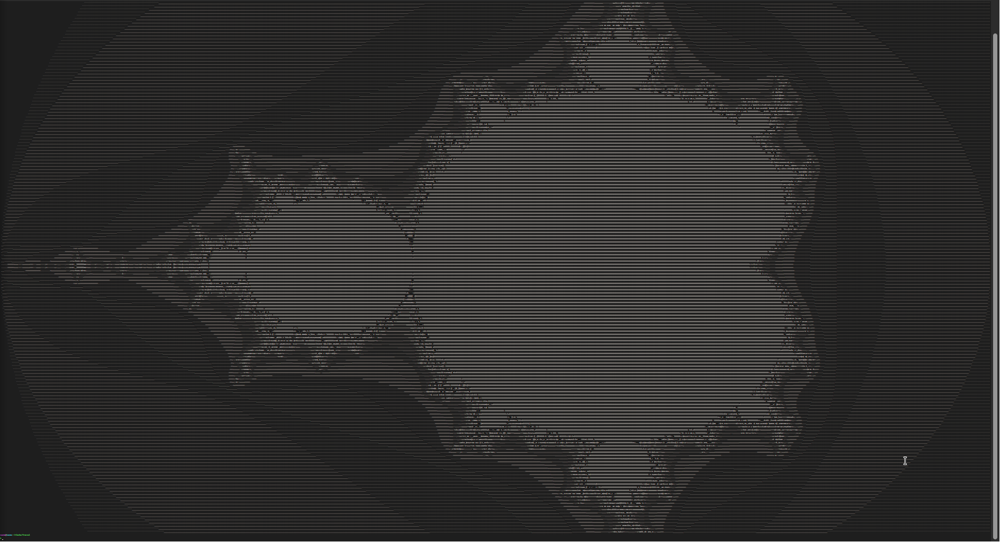
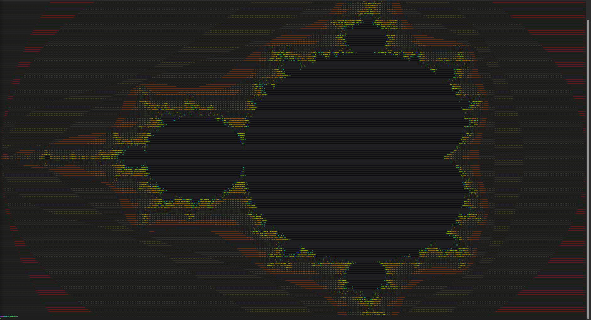

Mandelbrot set
====

## Examples

*Resolution 169 x 931; min zoom*

| Normal mode | Color mode | Color mode inverse |
| --- | --- | --- |
|  |  |  |


Text example also avaiable [here](mandelbrot_ascii.txt).


## A little bit of theory 

The equation for Mandelbrot set is:  $f_{c}(z)=z^{2}+c$

All we have to know (and realise) is in this table:

| $z_0=0$ | $z_{n+1}=z_n^2+c$ | $c = a + bi$ | $i^2 = -1$
| --- | --- | --- | --- |

When plugged into the main equation, we get:
$z_1 = 0^2 + c \iff z_1 = a+bi$

So all we have now is the complex number $c; c \in \mathbb{C}$.

But when we continue:
$z_2 = z_1^2+c \iff z_2 = c^2+c \iff z_1 = (a+bi)^2 + c$

Then $(a + bi)^2$ *using $A^2 + 2AB + B^2$*

$(a+bi)^2 = a^2 + 2abi + b^2 \cdot i^2 = a^2 - b^2 + 2abi$

$z_2 = a^2 - b^2 + 2abi + a + bi$
Which is, as we can see, another complex number with real part $a^2 - b^2$ and imaginary one $2ab$.

This process'll continue to the endless, so we have to set limitation → you can set whatever you want, I set **250** becouse its useless to use more iterations than that. `#define LIMIT 250`


## Programming integration

Now we have to integrate all that simple math into code.

First, it's fine to know the size of terminal window.

```c
#include <sys/ioctl.h>
#include <complex.h>

int width, height;

void getResolution() {
    struct winsize wnsz;
    ioctl(0, TIOCGWINSZ, &wnsz);

    width = (wnsz.ws_row);
    height = (wnsz.ws_col);
}

```

Now we have to represent "pixels". It's gonna be `x` and `y` loop in `callMandelbrot()` function.

```c
void callMandelbrot() {
    getResolution();

    for (int y = 0; y < width; y++) {
        for (int x = 0; x < height; x++) {
            // calling mandelbrot 
        } printf("\r\n");
    }
}
```

The basics are done, now we have to integrate the complex numbers.
First, we have to set (define) `LIMIT` of iterations, `START` position for $\mathbb{R}$ numbers, `START2` position for $\mathbb{C}$ numbers and `END` position:

```c
#define LIMIT 250
#define START -2.0
#define START2 -1.0
#define END 1.0
```

We can calculate the starting $a$ and $b$ using the defined values.
```c
// *calling mandelbrot*
            // a... real number; 
            // b... imaginary number
            double a = START + ((double) x / height) * (END - START);
            double b = START2 + ((double) y / width) * (END - START2);

            // c = a + bi;
            double complex c = CMPLX(a, b);

            // calculating mandelbrot
            int m = calculateMandel(c);
```

Lets integrate the math and calculate the mendelbrot...
We can do the same as in the theory section. Lets $z=0$. We know, that Hausdorff measure is 2, so we won't have higher value.

If $|z_n| \leq m$ and if the $n$ is lower than iteration `LIMIT` than we can calculate using the basic equation: $z_{n+1}=z_n^2+c$

I made just for better clarity parameter `zz`, it's just powered $z$.

*Functions `Cpow` and `Cadd` are just for simple complex number operations.*

```c

int calculateMandel(double complex c) {
    double complex zz, z = 0.0;
    int n = 0;

    // |z| <= 2;  Hausdorff measure = 2
    while ((cabs(z) <= 2) && (n < LIMIT)) {
        // zz = z^2
        // z = z^2 + c <=> z = zz + c
        zz = Cpow(z);
        z = Cadd(zz, c);
        
        n++;
    } return n;
}

```

And that's practically all. We just have to print the function now.
The best is, to use characters sorted by brightness and then print them by $m$ value.

```c
#define ASCII "M@#W$BG5E20Tbca?1!;:+=-,._` "
#define ASCII2 " `_.,-=+:;!1?acbT02E5GB$W#@M" // reversed chars

// [...]
            int m = calculateMandel(c);

            if (m > LIMIT) {
                printf(" ");
            } else {
                printf("%c", ASCII2[(m - 1) % strlen(ASCII2)]);
            }

```